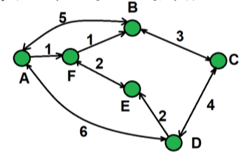

## Лабораторная работа 2. ИКНТ, Борисова Мария ИТ18 – группа LAB8

Лабораторная работа представляет из себя:
## Класс Main – главный класс, который вызывает в себе классы заданий 1 – 5.
## Классы заданий 1 – 5
  **1) public class Name**

  **2) public class Person**

  **3) public class NameEx4**

  **4) public class PersonWithParent**

  **5) public class PersonConstructor**

  **6) public class City**

  **7) public class Cat**
## Класс GlobalVerification – вспомогательный класс проверок ввода пользователя

Рассмотрим систему работы классов индивидуально

## Класс Main

Класс Main в общей структуре состоит из цикла while, который прокручивает реализацию всех заданий, 
выбор самих заданий в свою очередь осуществляется с помощью конструкции 
switсh-case – пользователь выбирает какое задание он предпочитает просмотреть и в зависимости от его выбора реализуется соответствующий case

```java
System.out.println("МЕНЮ");
System.out.println("№ Задания");
System.out.println("1 - Создание личностей ФИО");
System.out.println("2 - Создание личностей ФИО с ростом");
System.out.println("3 - Создание человека с родителем.");
System.out.println("4 - Создание системы городов и маршрутов");
System.out.println("5 - Создание имен с разными конструкторами");
System.out.println("6 - Создание человека разными способами");
System.out.println("7 - Создание Кота Барсика");
System.out.println("0 - ВЫХОД");
```
:vhs:
> Задание 1 – (1 - Создание личностей ФИО)

В данном задании было необходимо создать сущность Name, которая задана данными параметрами
Фамилия, Личное имя, Отчество.

Имя может быть приведено к строковому виду, включающему традиционное представление всех трех параметров: Фамилия Имя Отчество (например “Иванов Иван Иванович”). 

Необходимо предусмотреть возможность того, что какой-либо из параметров может быть не задан, и в этом случае он не учитывается при приведении к текстовому виду. 

Необходимо создать следующие имена: 
+ Клеопатра 
+ Пушкин Александр Сергеевич 
+ Маяковский Владимир 

Обратите внимание, что при выводе на экран, не заданные параметры никак не участвуют в образовании строки.

___

В ходе выполнения данного задания был создан case 1, в котором вызывался класс Name

### Система case 1:
1.  Демонстрирует создание объектов класса Name с разными конструкторами (только имя, ФИО, фамилия и имя)
2.  Выводит примеры созданных личностей
3.	Предлагает пользователю ввести свои данные через метод inputUserName()
4.	Обрабатывает ответ пользователя и либо показывает результат, либо возвращает в меню

### Система класса Name:
Класс состоит из полей, конструкторов и методов.

*Поля*:
+  lastName - фамилия
+  firstName - имя
+  middleName – отчество

*Конструкторы*:
+  Name(String, String, String) - ФИО полностью
+  Name(String, String) - фамилия и имя
+  Name(String) - только имя

*Методы*:
+  Геттеры для всех полей
+  Приватный метод isSet() - проверяет заполненность строки
+  Переопределенный toString() - формирует строковое представление

```java
1 - Создание личностей через ФИО
Имена задания №1
1. Клеопатра
2. Пушкин Александр Сергеевич
3. Маяковский Владимир
Личный ввод пользователя
Хотите ввести свои данные? (да/нет)
да
Выберите тип ввода:
1 - Только имя
2 - Фамилия и имя
3 - Полное ФИО
1
Введите имя: Мария
Результат: Мария
```
___
:vhs:
> Задание 2 – (2 – Создание личностей ФИО с ростом) 

В данном задании было необходимо объеденить сущности Человек из задачи 1.2 и Имя из задачи 1.3 таким образом, чтобы имя человека задавалось с использованием сущности 1.3, а не строки.

Необходимо объединить ранее созданные объекты имен и людей, с получением:

+  Человека с Именем Клеопатра и ростом 152
+  Человека с Именем Пушкин Александр Сергеевичи ростом 167
+  Человека с Именем Маяковский Владимир и ростом 189
___
В ходе выполнения данного задания был создан case 2, в котором вызывался класс Person

### Система case 2:
Демонстрирует создание объектов класса Person, которые объединяют ФИО (объекты Name) с ростом.
1.  Выводит примеры созданных личностей с указанием роста
2.	Предлагает пользователю ввести свои данные через методы inputUserName() и ввод роста
3.	Обрабатывает ответ пользователя и либо показывает результат с ростом, либо возвращает в меню

### Система класса Person:
Класс состоит из полей, конструкторов  и методов.

*Поля*:
+  name - ФИО (объект класса Name)
+  height - рост в сантиметрах

*Конструкторы*:
+  Person(Name, int) - создание личности с ФИО и ростом

*Методы*:
+  Геттеры для всех полей (getName(), getHeight())
+  Переопределенный toString() - формирует строковое представление в формате "ФИО, рост: X”

```java
2 - Создание личностей через ФИО с ростом
Имена задания №2
1. Клеопатра, рост: 152
2. Пушкин Александр Сергеевич, рост: 167
3. Маяковский Владимир, рост: 189
Личный ввод пользователя
Хотите ввести свои данные? (да/нет)
да
Выберите тип ввода:
1 - Только имя
2 - Фамилия и имя
3 - Полное ФИО
2
Введите фамилию: Борисов
Введите имя: Иван
Введите рост (положительное число): 156
Результат: Борисов Иван, рост: 156
```
___

:vhs:
> Задание 3 – (3 - Создание человека с родителем)


В данном задании было необходимо заменить сущность Человек из задачи 2.2 добавив ему возможность задавать третий параметр: Отец, где Отец — это тоже Человек. 

При приведении человека к строковой форме необходимо проверить параметры имени, и в зависимости от ситуации выполнить одно из следующих действий:

+  Если у данного человека нет фамилии, и есть отец, у которого фамилия задана, то фамилию необходимо сделать такой же как у отца. 
+  Если у данного человека нет отчества, а у отца есть имя, то необходимо задать отчество как имя отца с добавлением суффикса “ович”. 

Затем необходимо выполнить следующие задачи: 
1. Создать людей: 
Чудова Ивана, Чудова Петра, Бориса. 
2. Сделать Ивана отцом Петра, а Петра отцом Бориса. 
3. Вывести на экран строковое представление всех троих людей.
___

В ходе выполнения данного задания был создан case 3, в котором вызывался класс PersonWithParent.

### Система case 3:
Демонстрирует создание объектов класса PersonWithParent, которые расширяют функциональность Person добавлением родственных связей (родителей).
1.	Выводит примеры созданных личностей без родственных связей
2.	Устанавливает родственные связи между созданными объектами
3.	Выводит результат после установки связей, показывая иерархию отношений

### Система класса PersonWithParent:
Класс состоит из полей, конструкторов  и методов.

*Поля:*

+  name - ФИО (объект класса Name)
+  height - рост в сантиметрах
+  father - ссылка на объект-родитель (отец)

*Конструкторы:*

+  PersonWithParent(Name, int) - создание личности с ФИО и ростом без родителя
+  PersonWithParent(Name, int, PersonWithParent) - создание личности с ФИО, ростом и указанием отца

*Методы:*

+  Геттеры для всех полей (getName(), getHeight(), getFather())
+  Сеттер setFather() - устанавливает/изменяет родственную связь
+  Приватный метод updateNameFromFather() - автоматически обновляет ФИО на основе данных отца
+  Переопределенный toString() - формирует строковое представление с указанием родства

```java
3 - Создание человека с родителем
Имена задания №3 и установка родственных связей
Созданы люди:
1. Чудов Иван, рост: 175
2. Чудов Петр, рост: 180
3. Борис, рост: 185
Установление родственных связей
После установки родственных связей:
1. Чудов Иван, рост: 175
2. Чудов Петр Иванович, рост: 180 (сын Ивана)
3. Чудов Борис Петрович, рост: 185 (сын Петра)
```
____

:vhs:
> Задание 4 – (4 – Создание системы городов и маршрутов)

В данном задании было необходимо создать сущность Город, которая будет представлять собой точку на карте со следующими характеристиками: 

+  Название города 
+   Набор путей к следующим городам, где путь представляет собой сочетание Города и стоимости поездки в него. 

Кроме того, Город может возвращать текстовое представление, в виде названия города и списка связанных с ним городов (в виде пары: “название : стоимость”).

Используя разработанную сущность реализуйте схему, представленную на рисунке 2.



___

В ходе выполнения данного задания был создан case 4, в котором вызывался класс City

### Система case 4:
Демонстрирует создание и работу системы городов и маршрутов между ними.
1.	Создает сеть городов (A, B, C, D, E, F) с установленными маршрутами и стоимостями
2.	Выводит информацию о всех созданных городах и их маршрутах
3.	Предлагает пользователю выбрать конкретный город для просмотра исходящих маршрутов
4.	Рассчитывает и показывает детальную информацию о маршрутах выбранного города и общую стоимость

### Система класса City:
Класс состоит из полей, конструкторов  и методов.

*Поля:*

+  name - название города
+  connectedCities - массив связанных городов (маршруты)
+  costs - массив стоимостей маршрутов
+  routeCount - количество установленных маршрутов

*Конструкторы:*

+  City(String) - создание города с указанным названием

*Методы:*
+  Геттеры для основных полей (getName(), getRouteCount())
+  Методы доступа к маршрутам (getConnectedCity(), getCost())
+  Основной метод addRoute() - добавляет маршрут в город с указанной стоимостью
+  Переопределенный toString() - формирует строковое представление города с маршрутами

```java
4 - Система городов и маршрутов
Создано 6 городов: A, B, C, D, E, F
Город 'A' - (F: 1, D: 6, B: 5)
Город 'B' - (A: 5, C: 3)
Город 'C' - (B: 3, D: 4)
Город 'D' - (C: 4, E: 2, A: 6)
Город 'E' - (F: 2)
Город 'F' - (E: 2, B: 1)
Маршрут из конкретного города
Введите название города (A-F) для поиска маршрутов: A
 Маршруты из города A:
 ->> F (стоимость: 1)
 ->> D (стоимость: 6)
 ->> B (стоимость: 5)
  Общая стоимость всех маршрутов: 12
  ```
____

:vhs:
> Задание 5 – (5 – Создание имен с разными конструкторами)

В данном задании было необходимо изменить сущность Имя из задачи 1.3. Новые требования включают: 

+  Имя можно создать указав только Личное имя 
+  Имя можно создать указав Личное имя и Фамилию. 
+  Имя можно создать указав все три параметра: Личное имя, Фамилию, Отчество. 

Необходимо создать следующие имена: 

+  Клеопатра 
+  Александр Сергеевич Пушкин 
+  Владимир Маяковский 
+  Христофор Бонифатьевич (здесь Христофор это имя, а Бонифатьевич - фамилия)
___
В ходе выполнения данного задания был создан case 5, в котором вызывался класс NameEx4.
### Система case 5:
Демонстрирует создание объектов класса NameEx4 с использованием разных конструкторов для представления ФИО в различных форматах.
1.	Создает примеры личностей с разными вариантами ФИО:

    +  Только личное имя
    +  Полное ФИО (имя, фамилия, отчество)
    +  Имя и фамилия
    +  Имя и отчество
2.	Выводит результаты форматированного представления каждой личности

### Система класса NameEx4:

Класс состоит из полей, конструкторов  и методов.

*Поля:*

+  firstName - личное имя
+  lastName - фамилия
+  middleName - отчество

*Конструкторы:*

+  NameEx4(String) - только личное имя
+  NameEx4(String, String) - личное имя и фамилия
+  NameEx4(String, String, String) - полное ФИО (имя, фамилия, отчество)

*Методы:*

+  Геттеры для всех полей (getFirstName(), getLastName(), getMiddleName())
+  Приватный метод isSet() - проверяет заполненность строки
+  Переопределенный toString() - формирует строковое представление

```java
5 - Создание имен с разными конструкторами
Личности из задания №5
1. Клеопатра
2. Александр Пушкин Сергеевич
3. Владимир Маяковский
4. Христофор Бонифатьевич
```
___

:vhs:
> Задание 6 – (6 – Создание человека разными способами)

В данном задании было необходимо изменить сущность Человек из задачи 2.3. 

Новые требования включают: 

+  Человека можно создать с указанием имени в виде строки и роста в виде целого числа. При таком способе задания имени должно считаться, что Человеку задано только личное имя. 
+  Человека можно создать с указанием имени в виде строки, роста в виде целого числа и отца в виде Человека. В этом случае необходимо проставить отчество в соответствии с именем отца и присвоить текущему человеку фамилию отца. 
+  Человека можно создать с указанием имени в виде объекта типа Имя (из задачи 4.5) и роста в виде целого числа.
+  Человека можно создать с указанием имени в виде объекта типа Имя (из задачи 4.5), роста в виде целого числаи отца в виде Человека. 
В этом случае необходимо проверить что в Имени задано отчество и фамилия, и если они не заданы, то необходимо их задать (отчество в соответствии с именем отца и фамилию отца). 
+  Реализуйте описанные способы создания Человека таким образом, чтобы операции присвоения использовались только в одном из конструкторов. 
+  Необходимо модифицировать способ приведения Человека к строке, теперь текстовая форма должна быть представлена строкой: “Имя, рост”

Создайте и выведите на экран следующие объекты: 
+  Человека с именем Лев (в виде строки) и ростом 170 
+  Человека с именем Пушкин Сергей (как Имя), ростом 168 и отцом Львом (предыдущий Человек) 
+  Человека с именем Александр (в виде строки), ростом 167 и отцом Сергеем (предыдущий Человек)
___

В ходе выполнения данного задания был создан case 6, в котором вызывался класс PersonConstructor.

### Система case 6:
Демонстрирует создание объектов класса PersonConstructor разными способами с использованием различных конструкторов.


1.	Создает людей тремя способами:
    +  С именем в виде строки и ростом
    +  С именем как объект NameEx4, ростом и указанием отца
    +  С именем в виде строки, ростом и указанием отца
2.	Выводит результаты каждого способа создания, показывая формирование семейной иерархии

### Система класса PersonConstructor:

Класс состоит из полей, конструкторов  и методов.

*Поля:*

+  name - ФИО (объект класса NameEx4)
+  height - рост в сантиметрах
+  father - ссылка на объект-родитель (отец)

*Конструкторы:*

+  PersonConstructor(String, int) - создание с именем в виде строки и ростом
+  PersonConstructor(String, int, PersonConstructor) - создание с именем в виде строки, ростом и отцом
+  PersonConstructor(NameEx4, int) - создание с именем как объект NameEx4 и ростом
+  PersonConstructor(NameEx4, int, PersonConstructor) - создание с именем как объект NameEx4, ростом и отцом

*Методы:*

+  Геттеры для всех полей (getName(), getHeight(), getFather())
+  Приватный метод updateNameFromFather() - автоматически обновляет ФИО на основе данных отца
+  Переопределенный toString() - формирует строковое представление личности

```java
6 - Создание человека разными способами
Создание людей разными способами
1. Создание человека с именем в виде строки:
Результат: Лев, рост: 170

2. Создание человека с именем как объект NameEx4 и отцом:
Результат: Сергей Пушкин Левович, рост: 168

3. Создание человека с именем в виде строки и отцом:
Результат: Александр Пушкин Сергейович, рост: 167
```
___

:vhs:
> Задание 7 – (7 – Создание человека разными способами)

В данном задании было необходимо создать сущность Кот, которая описывается следующим образом: 

+  Имеет Имя (строка) 
+  Для создания необходимо указать имя кота.
+  Может быть приведен к текстовой форме вида: “кот: Имя” 
+  Может помяукать, что приводит к выводу на экран следующего текста: “Имя: мяу!”, вызвать мяуканье можно без параметров. 
+  Может помяукать Nраз, что приводит к выводу на экран следующего текста: “Имя: мяумяу-…-мяу!”, где количество “мяу”равно N. 

Создайте кота по имени “Барсик”, и затем пусть он помяукает сначала один раз, а затем три раза.
___
В ходе выполнения данного задания был создан case 7, в котором вызывался класс Cat.

### Система case 7:
Демонстрирует создание и взаимодействие с объектами класса Cat.

1.	Создает демонстрационного кота Барсика и выводит информацию о нем
2.	Демонстрирует функциональность мяуканья - одиночное и множественное
3.	Предлагает пользователю создать своего кота и настроить его поведение
4.	Обрабатывает пользовательский ввод для имени кота и выбора вариантов мяуканья

### Система класса Cat:
Класс состоит из полей, конструкторов  и методов.

*Поля:*
+  name - имя кота

*Конструкторы:*

+  Cat(String) - создание кота с указанным именем

*Методы:*

+  Геттер для имени (getName())
+  Метод meow() - одиночное мяуканье
+  Перегруженный метод meow(int) - множественное мяуканье указанное количество раз
+  Переопределенный toString() - формирует строковое представление кота

```java
7 - Создание Кота Барсика
Кот из задания №5
Создан: кот: Барсик
Мяуканье Барсика
Один раз: Барсик: мяу!
Три раза: Барсик: мяу-мяу-мяу!
Создание личного кота
Хотите создать своего кота? (да/нет)
да
Введите имя кота: Мопс
Создан: кот: Мопс
Хотите, чтобы кот мяукнул один раз? (да/нет): 
да
Мопс: мяу!
Хотите, чтобы кот мяукнул несколько раз? (да/нет): 
да
Сколько раз должен мяукнуть кот? 
7
Мопс: мяу-мяу-мяу-мяу-мяу-мяу-мяу!
```
___
## Класс GlobalVerification 
Класс состоит из методов, реализующих проверку ввода пользователя
1) метод -  public static String stringWithoutNum()
Считывает строку из консоли, проверяя что она содержит только буквы и пробелы.
    +  Цикл продолжается до получения корректного ввода.

```java
1 - Создание личностей через ФИО
Имена задания №1
1. Клеопатра
2. Пушкин Александр Сергеевич
3. Маяковский Владимир
Личный ввод пользователя
Хотите ввести свои данные? (да/нет)
да
Выберите тип ввода:
1 - Только имя
2 - Фамилия и имя
3 - Полное ФИО
1
Введите имя: Мария1234
Некорректный ввод! ФИО должно содержать только буквы. Введите заново: 
Мария
Результат: Мария
```
2) метод - public static int numberNum()
Считывает число из консоли, проверяя что оно находится в допустимом диапазоне.
    +  Цикл продолжается до получения корректного ввода.
```java
2 - Создание личностей через ФИО с ростом
Имена задания №2
1. Клеопатра, рост: 152
2. Пушкин Александр Сергеевич, рост: 167
3. Маяковский Владимир, рост: 189
Личный ввод пользователя
Хотите ввести свои данные? (да/нет)
да
Выберите тип ввода:
1 - Только имя
2 - Фамилия и имя
3 - Полное ФИО
1
Введите имя: Мария
Введите рост (положительное число): -234
Введите положительное число от 135: 
123
Введите положительное число от 135: 
167
Результат: Мария, рост: 167
```
3) метод - public static int numberNumMiu()
Считывает положительное число из консоли.
    +  Цикл продолжается до получения корректного ввода.
```java
7 - Создание Кота Барсика
Кот из задания №5
Создан: кот: Барсик
Мяуканье Барсика
Один раз: Барсик: мяу!
Три раза: Барсик: мяу-мяу-мяу!
Создание личного кота
Хотите создать своего кота? (да/нет)
да
Введите имя кота: Марсик
Создан: кот: Марсик
Хотите, чтобы кот мяукнул один раз? (да/нет): 
да
Марсик: мяу!
Хотите, чтобы кот мяукнул несколько раз? (да/нет): 
да
Сколько раз должен мяукнуть кот? 
-8
Введите положительное число от 1: 
4
Марсик: мяу-мяу-мяу-мяу!
```
___
## Описание наиболее сложных методов проекта

**Вспомогательный метод  - private static Name inputUserName(Scanner scanner) класса Main.**

1. Предлагает выбрать тип ввода ФИО (только имя, фамилия+имя, полное ФИО)
2. Считывает и валидирует данные через GlobalVerification.stringWithoutNum() (проверка на отсутствие цифр)
3. Создает соответствующий объект Name используя подходящий конструктор
4. Возвращает готовый объект или null при ошибке выбора

**Вспомогательный метод  - private static int meni(int number)**

1.	класса Main  
Предлагает выбрать действие (Меню, Повторить задание, Выход)
2.	Обрабатывает выбор пользователя и возвращает соответствующее значение:
    +  -1 - возврат в главное меню
    +  number - повтор текущего задания
    +  0 - завершение программы
3.	Защита от некорректного ввода - при ошибочном выборе возврат в меню

**Метод - public String toString() класса Name.**

1. Проверяет заполненность каждого компонента ФИО через метод isSet()
Последовательно добавляет компоненты в результирующую строку
Разделяет компоненты пробелами только если предыдущие компонентысуществуют
2.	Возвращает отформатированную строку ФИО в правильном порядке

**Метод-  public void setFather(PersonWithParent father) класса PersonWithParent**

1. Устанавливает ссылку на отца в поле father
2. Автоматически обновляет ФИО через вызов updateNameFromFather()
3. Наследует фамилию и формирует отчество на основе данных отца

**Метод -  private void updateNameFromFather() класса PersonWithParent**

1. Проверяет наличие отца и его ФИО
2. Наследует фамилию отца если текущая фамилия не задана
3. Формирует отчество от имени отца если текущее отчество не задано
4. Создает новый объект Name с обновленными данными

**Метод - public void addRoute(City city, int cost) – класса City**

1. Проверяет возможность добавления маршрута (лимит 10 маршрутов)
2. Добавляет город в массив connectedCities по текущему индексу routeCount
3. Сохраняет стоимость в параллельный массив costs
4. Увеличивает счетчик маршрутов routeCount

**Метод - public String toString() класса city**

1. Формирует базовое название города
2. Проверяет наличие маршрутов - если нет, сообщает об отсутствии
3. Перебирает все маршруты и добавляет их в формате "город: стоимость"
4. Разделяет маршруты запятыми для читаемости

**Метод - public String toString() класса NameEx4**

1. Проверяет и добавляет имя если оно задано
2. Проверяет и добавляет фамилию с пробелом перед ней, если уже есть данные
3. Проверяет и добавляет отчество с пробелом перед ним, если уже есть данные
4. Возвращает отформатированное ФИО без лишних пробелов

**Метод - private void updateNameFromFather() класса PersonConstructor**

1. Проверяет наличие отца и его ФИО
2. Извлекает текущие компоненты ФИО для возможного обновления
3. Наследует фамилию отца если текущая фамилия не задана
4. Формирует отчество от имени отца если текущее отчество не задано
5.  Создает новый объект NameEx4 с обновленными данными

**Метод - public void meow(int n) класса Cat**

1. Проверяет корректность количества - при n ≤ 0 выводит многоточие
2. Формирует цепочку "мяу" через StringBuilder с разделителем "-"
3. Добавляет восклицательный знак в конец цепочки
4. Выводит результат с именем кота в формате "имя: мяу-мяу-мяу!"


